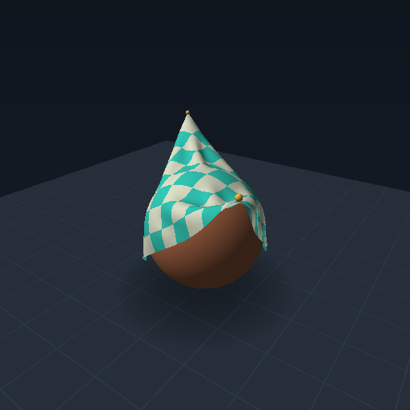
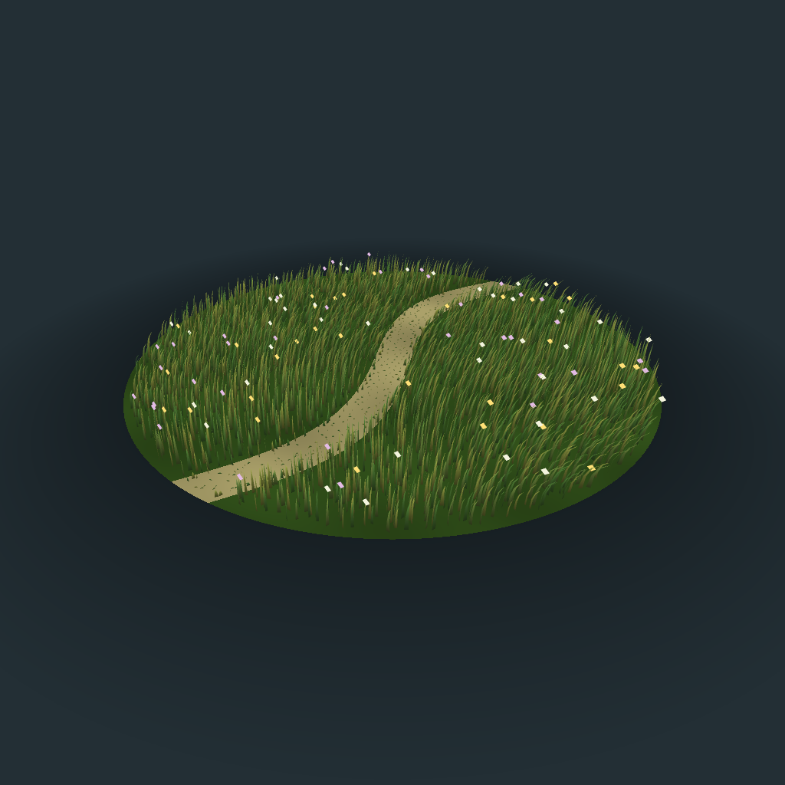
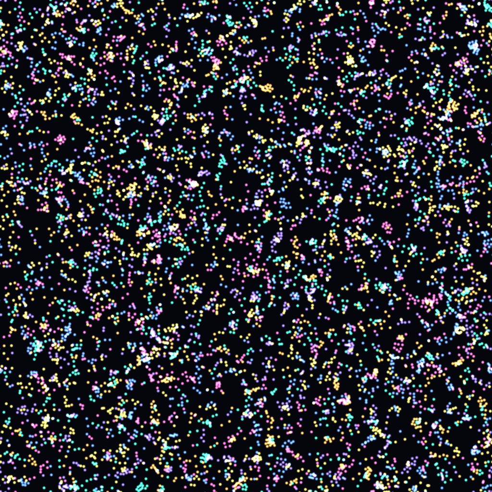

# Bend simulation engine

A GPU-native simulation engine experiment in **Bend 2.0.27**, with a reusable
2D/3D spatial API and four native demos: boids, cloth, wind-driven meadow and Particle Life.
The same Bend simulations and renderers run on CPU or Metal. No custom foreign
simulation or rendering kernels are used.

## Run

Prerequisites: Bun, Git, and Bend's native prerequisites (on this Mac, Apple
Clang and Metal). The system Bend installation is left unchanged.

```sh
cd bend-swarm
scripts/setup
scripts/build
scripts/run-cloth   # 3D cloth
scripts/run-meadow  # 4,096 curved grass blades
scripts/run-life    # 8,192 interacting particles, six species
# scripts/run      # 131,072 boids
```

On macOS, the build also creates app bundles for each demo in `build/`.
Launchers require a GPU; run `build/cloth --gpu off` or
`build/swarm --gpu off` explicitly for a CPU-only session. G changes dispatch
inside the app; a runtime started with `--gpu off` always executes on CPU.

### Cloth



A 32×32 sheet with two opposite pinned corners, gravity, wind, structural/shear/
bending constraints, sphere/floor contact and spatial vertex/face and edge/edge contact.
A pure Bend triangle renderer provides perspective, interpolated vertex lighting and depth occlusion.
Standard quality displays a 512² framebuffer. **Q** selects a sharper 1024²
framebuffer with a smooth 64×64 visual surface. Both modes simulate the same
32×32 physical grid; higher quality never quadruples the physics workload.

- **Drag the fabric:** pull a nearby vertex with a compliant spring in the view plane.
- **Space:** pause. **R:** reset. **W:** wind. **G:** CPU/GPU. **Q:** quality/reset. **H:** details.
- **A:** four-sample geometry anti-aliasing. **D:** depth of field. Both are off initially to preserve the frame budget.
- **Escape:** close.

The interactive loop advances fixed 1/120-second physics steps from elapsed time
and paces presentation at 60 Hz. Catch-up is capped at two steps after a stall to prevent runaway work.
The demo starts on CPU with a coarse execution plan for this small mesh; **G**
compares the same algorithm on Metal. The HUD identifies the selected backend.

Surface contacts retain the previous side of each face/edge, and dragging is
bounded rather than teleporting a vertex. This remains a discrete PBD example,
not a continuous collision detector or a calibrated material model. The native
regression includes ten seconds of draping, dragging and release, checked for
non-adjacent triangle crossings by an independent geometry oracle.

### Wind-driven meadow



4,096 rooted grass blades bend under a coherent wind field and mouse gusts.
Quadratic curves form tapered ribbons, with scattered flowers and a winding
path. Perspective projection, depth occlusion and optional postprocessing use
shared engine modules. Everything is simulated and drawn in Bend. **Q** switches between 1024² and 2048² without resetting the simulation.

- **Hold the mouse:** gust. **1 / 2 / 3:** calm, breeze, strong wind.
- **A:** four-sample geometry anti-aliasing. **D:** subtle depth of field. **Q:** resolution.
- **Space:** pause. **R:** reset. **G:** CPU/GPU. **H:** details. **Escape:** close.

Meadow starts on CPU at 1024² with effects off. A, D and Q are explicit quality choices; they cost frame time.

### Particle Life



8,192 particles in six species follow attraction/repulsion rules through the
same generic spatial stencil as boids and cloth. All neighbors within 32 pixels
participate, including across the periodic world seam. A reusable additive
sprite renderer supplies glow and analytic edge coverage.

- **Left/right mouse:** attract/repel.
- **1 / 2 / 3:** islands, chasers, seeded random rules. **R:** reseed.
- **A:** smooth sprite edges. **Q:** 1024² / 2048². **Space:** pause. **G:** CPU/GPU. **H:** details. **Escape:** close.

Particle Life starts on Metal with smooth sprite edges enabled.

Meadow and Particle Life advance one fixed 1/60-second step per displayed frame;
they run slower in simulation time when rendering cannot keep up. Depth of
field applies to 3D mesh scenes, not the 2D particle canvas. See
[RENDERING.md](docs/RENDERING.md) for the shared API and effect limitations.

### Swarm

- **Left/right mouse:** attract/repel; release to resume ordinary flocking.
- **G:** CPU/GPU. **Space:** pause. **R:** reset. **H:** details.
- **[ / ]:** halve/double population, from 1024 to 1048576.
- **Escape:** close.

Boids maintain a cruising speed of 20–60 world units per simulated second and
cross cell, image-tile and world boundaries. Every neighbor inside the radius
contributes; there are no hidden candidate caps. Capacity is not a real-time
performance guarantee.

## Generic spatial API

The public API is [engine/spatial.bend](engine/spatial.bend), documented in
[SPATIAL_API.md](docs/SPATIAL_API.md). Its lifecycle is:

```text
create index → build(source, index) → snapshot
snapshot + output → stencil(~read, ~begin, ~visit, ~finish, …) → step
release(step) → original source + updated output + reusable index + statistics
```

Layouts support 2D/3D, bounded/periodic domains, arbitrary query radii and partial
populations. Snapshots retain ownership of indexed state. Typed layouts prevent
accidental layout mismatches. Callbacks are statically specialized; each output
region reads the previous state and writes its own output slots.

The [boids](demos/swarm/boids.bend), [cloth](demos/cloth/surface.bend) and
[Particle Life](demos/life/simulation.bend) demos use the
same stencil with their own state and equations. The old specialized boids
kernel remains as a reference. Unsafe sharing stays inside documented engine
primitives; callback ownership obligations are tested contracts, not formal
race-freedom guarantees.

## Verify and measure

```sh
scripts/test
scripts/test --native
python3 scripts/bench.py --agents 131072 --backend gpu
python3 scripts/bench-cloth.py --backend gpu
python3 scripts/bench-cloth.py --backend cpu
python3 scripts/bench-cloth.py --backend cpu --quality high
scripts/preview-cloth
python3 scripts/bench-showcase.py --demo meadow --backend cpu --effects aa --tag meadow-local
python3 scripts/bench-showcase.py --demo life --backend gpu --effects aa --tag life-local
scripts/preview-showcase meadow
scripts/preview-showcase life
```

Tests cover independent all-pairs oracles, 120 generic spatial cases, CPU/Metal
agreement, 120-frame boids boundary/image regressions, cloth pins/gravity/contact/
stretch, perspective picking, full-frame triangle coverage/depth and structural
proofs. Additional tests cover stable grass springs, independent species-force
and sprite-coverage oracles, immutable color/depth sources and depth-aware
postprocessing. Native quality checks cover 2048² mesh/sprite output, full Image
assembly, four-sample depth coverage and exact supersampling resolve. Native
GPU checks require an available Metal device.

On this Apple M2 Pro, a sequential 120-warmup/600-sample comparison measured
**33.11 ms** median for 131,072 boids through the generic API and **38.61 ms**
for the preserved specialized executable. These are complete headless frame
costs, excluding HUD and presentation. See [PERF.md](docs/PERF.md) and raw
`results/` records for cloth measurements, scope and historical runs. There is
no million-boids-at-60-Hz claim.

The larger research brief still has open architecture experiments. The previous
interactive Swarm Metal internal error also remains unresolved; passing these
headless tests does not establish that its trigger is fixed. See
[STATUS.md](docs/STATUS.md), [FINDINGS.md](docs/FINDINGS.md),
[ARCHITECTURE.md](docs/ARCHITECTURE.md), and the [original brief](docs/BRIEF.md).
